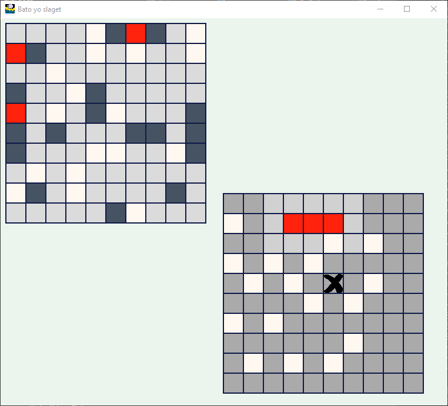

Bato-yo-slaget (Battleship)
==========

A python implimentation of the classic battleship game.

## History

Basic logic inited on **@JBKahn** [code](https://github.com/JBKahn/Battleship).

Features that I liked:

- board size is a variable
- amount of cpu players defined in runtime
- user ships can be placed on the board randomly
- simple console output

And added important things:

- ships can not intersects
- unlimited amount of players (strange feature of course)
- split a whole chunk on small classes (one class - one file)
- game logic combined to python module


From **@tmac-balla** I've taken [code](https://github.com/tmac-balla/battleship-game) to provide visualization of game logic on PyGame library.

* base classes of logic was extended by sprites, fonts and rectangles
* game classes connected to engine (similar chunk for any game on PyGame)


## Current state of developing



- not complete game session
- not stable
- and so on :)

## Run

Requires [Pygame](http://www.pygame.org/download.shtml).

To run game
```
cd src/py
python run-pygame.py
```
 
