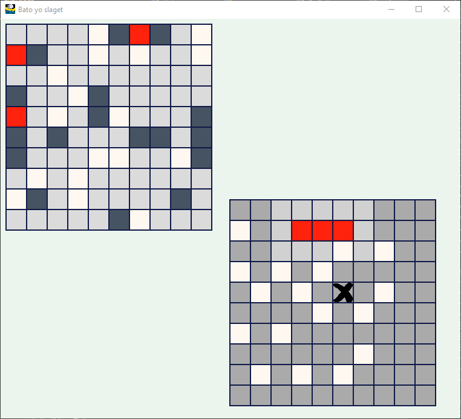

# Bato Yo Slaget


A Python implementation of the classic battleship game.

Requires [Pygame](http://www.pygame.org/download.shtml)

```
pip install pygame
```

Play
```
python run-pygame.py
```
 
**Controls**: arrow keys; Enter to select, fire or place a ship; Space to rotate ships.




## License

MIT
